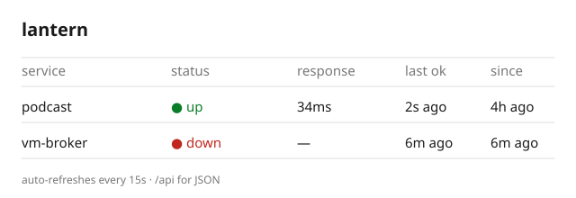

<p align="center">  <a href="https://tailscale.com/"></a></p>

**lantern** is a small private uptime monitor for services across your devices. It runs as one Go binary, checks each service in a config file, and shows a tiny dashboard: reachable, response time, last successful check. It answers "is the machine offline, or is just the application broken?"

## Setup

Requires Go 1.23+. On a fresh macOS machine, install [Homebrew](https://brew.sh), then:

```sh
git clone git@github.com:nadiaenh/lantern.git
cd lantern
brew bundle
go build -o lantern .
```

Copy `lantern.toml` and point it at your own services (address them by their Tailscale name):

```toml
interval = "15s"
timeout  = "5s"

[[services]]
name = "podcast"
url  = "http://podcast-server:8080/health"
```

## Usage

```sh
# Watch the services in lantern.toml and serve the dashboard.
./lantern serve --config lantern.toml --addr :8080
# open http://localhost:8080  (JSON at /localhost:8080/api)

# When one is down, check DNS, Tailscale, and the HTTP call separately.
./lantern diagnose podcast

# Run the tests (status transitions, timeouts, config parsing).
go test ./...
```

Publish the dashboard privately on your tailnet with Tailscale Serve:

```sh
tailscale serve --bg 8080          # private HTTPS at https://<this-machine>.<tailnet>.ts.net
tailscale funnel --bg 8080         # optional: expose it publicly
```

Narrow the monitor's access to only the ports it checks with Tailscale [grants](https://tailscale.com/kb/1324/grants); remove broader grants for that to matter.

## Demo

<p align="center"></p>
